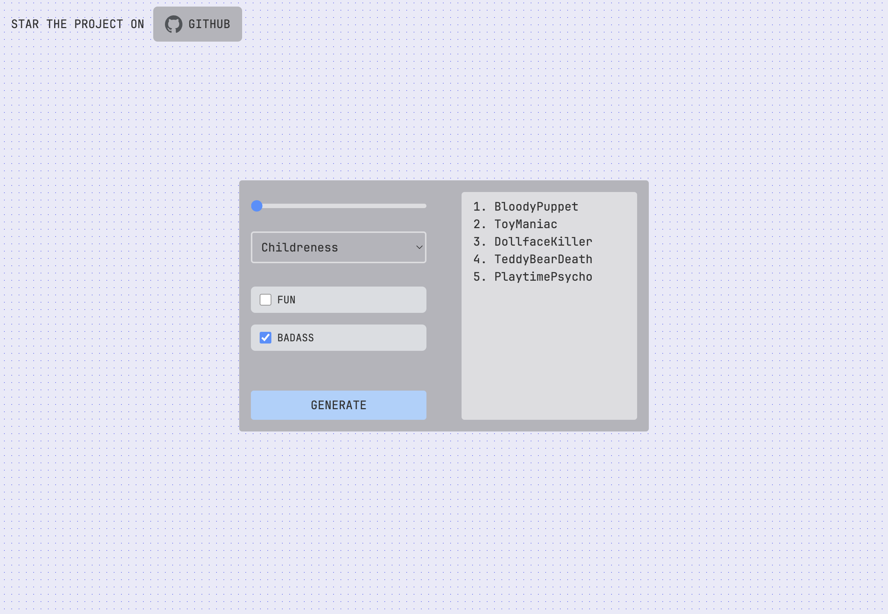

# Pseudo Generator



## Description

This is a small project to generate pseudo, you can select the number of pseudo who gonna be generate, the style etc... Hope you enjoy ! Feel free to drop a ⭐ on the repo or contribute ! 😎

## Summary

- [Description](#description)
- [Technology Stack](#technology-stack)
- [Command](#command)
- [Add my API key](#add-my-api-key)
- [Author](#author)

## Technology Stack

[](https://github-readme-tech-stack.vercel.app/api/cards?lineCount=2&hideTitle=true&line1=react,react,926cbc;tailwindcss,tailwindcss,2b971b;framer,framer,8e290a;&line2=typescript,typescript,c1e609;vite,vite,1c89d2;)

## Command

To use this project :

This move to a folder where you want to place this project and copy the project there :

```bash
git clone https://github.com/Sakoutecher/pseudo-generator.git
```

Then you have to install all dependencies, you can do it with the npm package manager or pnpm, it is according to your preferences, for this you have to use this command :

```bash
npm install or pnpm install
```

Once this is done, you only have to start the project by executing the command :

```bash
npm run dev
```

## Add my API key

To add your api key to the project and make it functionnal, go on [openai api management page](https://platform.openai.com/account/api-keys).

Create your api key. When you done that, go on the project and create at the root of the project the `.env` file.

Write this inside :

```bash
VITE_OPENAI_API_KEY=YOUR API KEY
```

Replace "YOUR API KEY" by the one you copy.

And that's it.

## Author

- [@Sakoutecher](https://github.com/Sakoutecher)
